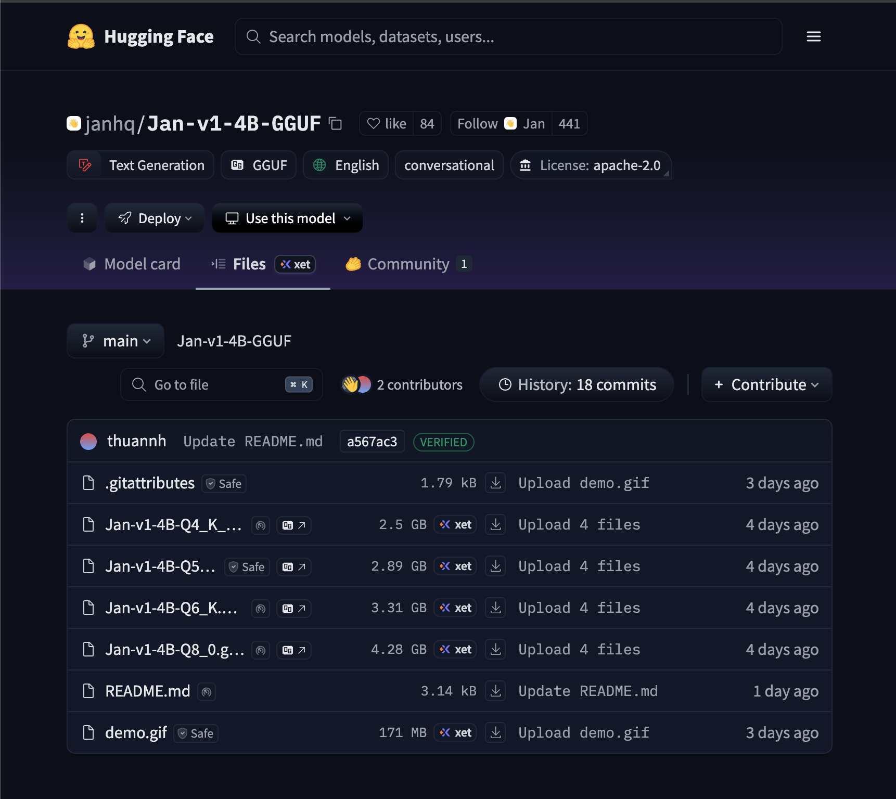

# noesisnoema-pipeline

[](https://github.com/raskolnikoff/noesisnoema-pipeline/releases)
[](#)
[](#)
[](LICENSE)

## Overview (Updated 2025-06)
**noesisnoema-pipeline** is a minimal, practical pipeline for:

1) **Fetching GGUF LLMs via the Hugging Face CLI** – to run with llama.cpp–compatible runtimes on iOS/desktop/server.
2) **Building a RAGpack (chunks + embeddings)** – split documents, embed them, and ship as a `.zip` your apps can load.

> Legacy CoreML conversion and tokenizer archive steps were removed to avoid confusion. If you still need them, check historical branches.

---

## What you can do here
- Safely download **GGUF** (often quantized) community models from Hugging Face.
- Produce a **RAGpack** (`chunks.json`, `embeddings.npy`, `embeddings.csv`, `metadata.json`).
- (Optional) Execute the same workflow on **Google Colab** using our helper notebook.

---

## Step‑by‑step

### 0) Requirements
- macOS / Linux (Windows works best via WSL)
- Python 3.10+ (CLI usage also works on 3.8+)
- `git`

### 1) Hugging Face account & access token
1. Create an account: https://huggingface.co/join  
2. Issue a token: **Settings → Access Tokens → New token**  
   - **Role**: *Read*  
   - Prefer **Fine‑grained** and enable **Gated repos: Read** (required for Meta Llama and other gated repos).
3. For gated models, visit the model page and **Accept** the license/usage policy.

### 2) Install the CLI and log in
```bash
python -m pip install -U "huggingface_hub[cli]"
# or, if you prefer pipx
# pipx install 'huggingface_hub[cli]'

huggingface-cli login    # paste your token when prompted
huggingface-cli whoami   # sanity check
```

> For faster downloads, enable the HF Transfer extension:
> ```bash
> python -m pip install -U hf_transfer
> export HF_HUB_ENABLE_HF_TRANSFER=1
> ```

### 3) Download a GGUF model (recommended: `huggingface-cli download`)
**Basic form**
```bash
huggingface-cli download <repo_id> \
  --include "*.gguf" \
  --local-dir models/<your_model_dir>
```

Filter by a given quantization (example: **Q4_K_M** only):
```bash
huggingface-cli download <repo_id> \
  --include "*Q4_K_M.gguf" \
  --local-dir models/<your_model_dir>
```

**Examples**
- **Jan v1 4B (GGUF)** – pick a repo that actually contains `.gguf` files (check the *Files* tab):

  The fastest and recommended way is to log in to Hugging Face via your browser and download directly from the model page.

  

  The Colab and CLI methods remain as alternatives for automation or remote environments.

```bash
# Example placeholder; replace with a real GGUF repo if different
huggingface-cli download janhq/Jan-v1-4B-GGUF-Q4_K_M \
  --include "*Q4_K_M.gguf" \
  --local-dir models/jan-v1-4b
```

- **TinyLlama (lightweight / quick check)**
```bash
# Example community GGUF repo
huggingface-cli download TheBloke/TinyLlama-1.1B-Chat-v1.0-GGUF \
  --include "*Q4_K_M.gguf" \
  --local-dir models/tinyllama-1.1b
```

**Verify**
```bash
ls -lh models/<your_model_dir>
shasum -a 256 models/<your_model_dir>/*.gguf   # optional integrity check
```

> **Why the CLI over `git clone`?**  
> Large LFS repos often include many artifacts you don’t need. `huggingface-cli download --include` pulls only what you ask for and avoids common failures/timeouts.

### 4) Build a RAGpack (chunks + embeddings)
Use the notebook under `notebooks/` to turn your documents into a self‑contained **RAGpack**. Output files:
- `chunks.json` — split text
- `embeddings.npy` — NumPy embeddings (fast to load)
- `embeddings.csv` — CSV embeddings (easy to load from Swift/iOS, etc.)
- `metadata.json`

> RAGpack is model‑agnostic and independent of the GGUF download step.

---

## Optional: run on Google Colab
You can do the same on Colab. We provide a helper notebook that includes a preset model selection dropdown with options for distilgpt2, llama3-8b, mistral, gemini, and jan-v1-4b. The notebook lists available `.gguf` files interactively, allows you to choose one, and lets you download files directly to a mounted Google Drive folder if desired.

**Notebook**: `gguf_downloader_colab.ipynb`  
Usage:
1. Upload the notebook to Colab and run the first cell to install deps.
2. (Optional) Mount Google Drive if you want to persist models.
3. Log in with your HF token (fine‑grained, Read; enable *Gated repos: Read* if necessary).
4. Pick a preset from the dropdown or type an exact `repo_id`.
5. The notebook lists `.gguf` files → choose one → **Download** directly to your mounted Drive or local Colab storage.

---

## Troubleshooting
- **403 Forbidden (gated)**: Accept the license on the model page and ensure your token allows **Gated repos: Read**.
- **Nothing downloads / 404**: Double‑check `repo_id` and make sure the repo actually contains `.gguf` files.
- **Slow/unstable**: Install `hf_transfer` and set `HF_HUB_ENABLE_HF_TRANSFER=1`. Use `--resume-download` to continue interrupted downloads.
- **Colab disk limits**: Mount Google Drive and set `--local-dir` to a Drive folder.

---

## Minimal repo layout
```
noesisnoema-pipeline/
├── notebooks/            # RAGpack notebook(s), Colab‑friendly
├── exported/             # Artifacts (kept empty; has a `.gitkeep`)
├── README.md
└── .gitignore
```

`.gitignore` (excerpt):
```
__pycache__/
.ipynb_checkpoints/
*.pyc
*.pyo
.env
.venv
exported/
models/
*.npy
*.jsonl
.DS_Store
*.log
```

---

## License
MIT License (see `LICENSE`). Each model retains its own license; always follow the model’s Hugging Face page.

## Acknowledgements
- Hugging Face and the OSS community.
- All contributors to NoesisNoema / RAGfish.
